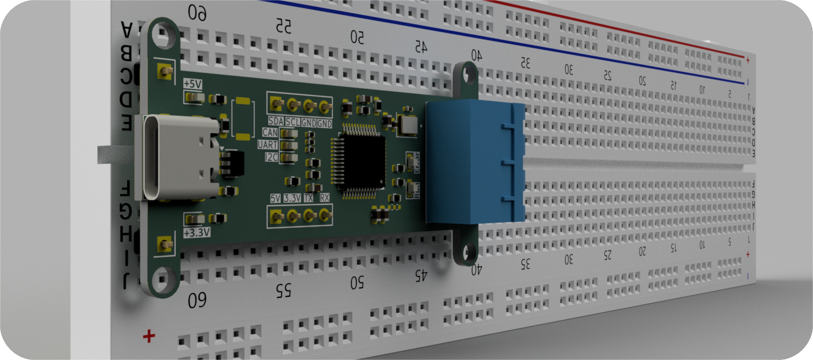

# Universal USB to CAN/UART/I2C Converter
A flexible and reliable USB converter for embedded system developers. This tool allows communication between a host PC and embedded devices via CAN, UART, and I2C protocols using a single USB interface.

## 🔧 Features
USB to CAN communication using CAN transceiver (e.g., MCP2551 or TJA1050)

USB to UART interface (up to 2 UART ports)

USB to I2C interface with master mode support

Cross-platform serial communication via USB CDC

Selectable interface via command or GUI tool

Open-source firmware and host-side tools

## 🧩 Applications
Debugging embedded devices

Communicating with automotive ECUs (CAN)

I2C device testing (sensors, EEPROMs, etc.)

Serial monitoring and control via UART

## 🖼️ Device Preview

The image below shows the USB to CAN/UART/I2C Converter mounted on a breadboard.  
You can see the USB-C connector on the left, the CAN interface on the right (blue connector), and clearly labeled headers for UART, I2C, and power in the center.  
This visual demonstrates the compact and practical layout, ideal for prototyping and embedded system development.

